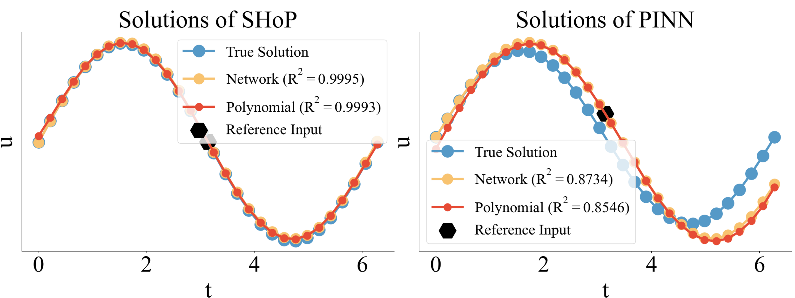
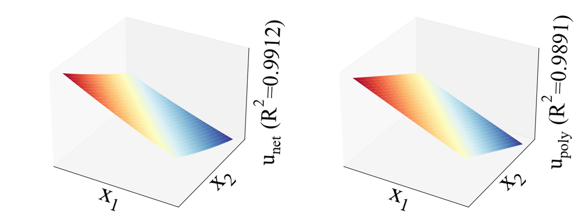
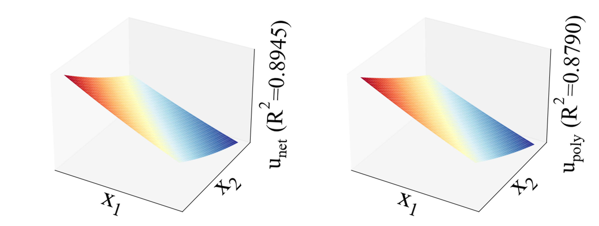

# SHoP: A Deep Learning Framework for Solving High-order Partial Differential Equations

## Quickstart

### 1. Setup a conda environment and install the pytorch

    conda create -n shop python=3.9
    conda activate shop
    conda install pytorch torchvision torchaudio pytorch-cuda=11.8 -c pytorch -c nvidia
    
[Install PyTorch corresponding to your device.](https://pytorch.org/get-started/locally/)

### 2. Installing python libraries

    pip install -r requirements.txt

## Solve a PDE
### A 1D 4th-order Harmonic oscillator system
#### (a) Solve a 1D 4th-order Harmonic oscillator system with HOPE and Autograd seperately

    python main.py -p opt/harmonic.yaml -g 0 
    python main.py -p opt/harmonic_pinn.yaml -g 0 

#### (b) Expand ''black-box'' neural networks into explicit polynomials

    python shop.py -d outputs/Harmonic/model/final.pt -o 10 -p 3.1415926 -s
    python plot.py -d outputs/Harmonic/model/npy/SHoP_[[3.1415926]]_10.npy -r 3.1415926
    python shop.py -d outputs/HarmonicPINN/model/final.pt -o 10 -p 3.1415926 -s
    python plot.py -d outputs/HarmonicPINN/model/npy/PINN_[[3.1415926]]_10.npy -r 3.1415926

<div>
    
</div>

The explicit expression of the ''black-box'' neural network is

$$\begin{aligned}
    u(t)&=0.0056-\frac{0.9943}{1!}\Delta_{\pi}+\frac{0.0099}{2!}\Delta_{\pi}^2+\frac{0.9988}{3!}\Delta_{\pi}^3
    -\frac{0.0238}{4!}\Delta_{\pi}^4-\frac{1.0092}{5!}\Delta_{\pi}^5+\frac{0.0685}{6!}\Delta_{\pi}^6+\frac{1.0896}{7!}\Delta_{\pi}^7  \hspace{100cm} \\
    &\approx -\frac{1}{1!}\Delta_{\pi}+\frac{1}{3!}\Delta_{\pi}^3-\frac{1}{5!}\Delta_{\pi}^5+\frac{1}{7!}\Delta_{\pi}^7 \\
\end{aligned}$$

from which we can see that the original solution is $y=sin(x)$.


### A 2D 8th-order Helmholtz equation

#### (a) Solve a 1D 8th-order Helmholtz equation with HOPE and Autograd seperately

    python main.py -p opt/helm.yaml -g 0 
    python main.py -p opt/helm_pinn.yaml -g 0 

Solving this high-order PDE using SHoP took 834 seconds, while PINN required 1.18e5 seconds but yielded an unsatisfactory result.

#### (b) Expand ''black-box'' neural networks into explicit polynomials and calculate metrics

    python shop.py -d outputs/Helm/model/final.pt -o 8 -p 0.5,0.5 -s
    python plot.py -d outputs/Helm/model/npy/SHoP_[[0.5,0.5]]_8.npy -r 0.16

<div>
    
</div>

    python shop.py -d outputs/HelmPINN/model/final.pt -o 8 -p 0.5,0.5 -s
    python plot.py -d outputs/HelmPINN/model/npy/PINN_[[0.5,0.5]]_8.npy -r 0.16

<div>
    
</div>

The $R^2$ score of the solution obtained by SHoP is as high as 0.9912, and the $R^2$ score of its explicitly expanded solution is also impressive at 0.9891. However, when using PINN to solve this high-order PDE, it not only consumes a substantial amount of time and GPU resources but also achieves only a modest $R^2$ score of 0.8945.

# Citations
```
@inproceedings{xiao2024shop,
  title={Shop: A deep learning framework for solving high-order partial differential equations},
  author={Xiao, Tingxiong and Yang, Runzhao and Cheng, Yuxiao and Suo, Jinli},
  booktitle={Proceedings of the AAAI Conference on Artificial Intelligence},
  volume={38},
  number={14},
  pages={16032--16039},
  year={2024}
}
```
If you are interested in the principle of Taylor expansion of neural networks, you can refer to our another article
https://github.com/HarryPotterXTX/HOPE.git
```
@article{xiao2024hope,
  title={HOPE: High-order Polynomial Expansion of Black-box Neural Networks},
  author={Xiao, Tingxiong and Zhang, Weihang and Cheng, Yuxiao and Suo, Jinli},
  journal={IEEE Transactions on Pattern Analysis and Machine Intelligence},
  year={2024},
  publisher={IEEE}
}
```
# Contact
If you need any help or are looking for cooperation feel free to contact us.
xtx22@mails.tsinghua.edu.cn
